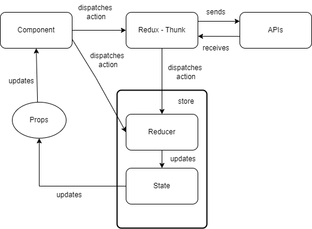

## Choice Of Frameworks

React js along with Redux for state management and React Router for navigation and axios for handling API requests.

## Architecture

## Future Enhancements

UI can be enhanced further with more user interactions.

## Features

1. History Page provides events history of spacex with date and time stamp with a link that navigates to an article.Selecting any particular event history will navigate to a page that renders the specifics of the event.

2. Launches Page renders the past launches and upcoming launches by spacex. Selecting any launch from the carousel
   will navigate to a page that renders the specifics of the launch.
3. Rockets Page provides the rockets owned by spacex and provides a filter option to filter the rockets based on name. Upon selection of a particular rockets fetches the information about it.

## Available Scripts

In the project directory, you can run:

## Package Installation:

### `npm i or yarn `

Installs the required packages needed to run the project.

### `npm start /yarn start`

Runs the app in the development mode.\
Open [http://localhost:3000](http://localhost:3000) to view it in your browser.
